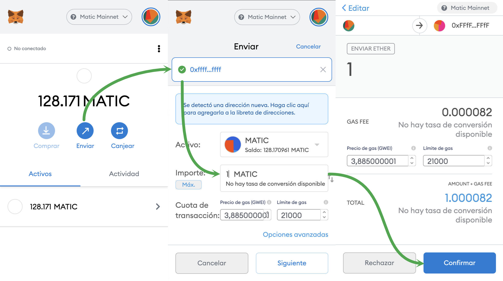
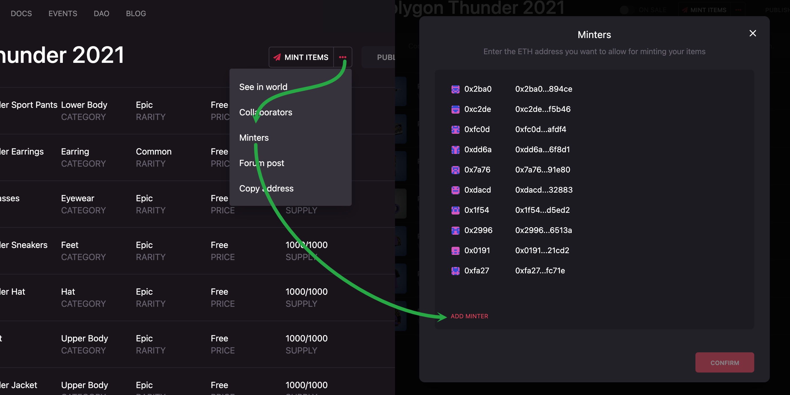

# L2 Airdrop

This repository is a collection of command line tools to do massive Airdrops of Decentraland Wearables on Matic

&nbsp;

## Index

- [Requirements](#requirements)
- [Installation](#installation)
- [Setup](#setup)
- :warning: [Warnings](#warnings)
- [Command: `environment`](./src/environment.md): Check current environment configuration
- [Command: `send`](./src/send.md): Send wearables to a list of addresses
- [Command: `tx`](./src/transactions.md): Inspect, cancel or speed up transactions
- [Tutorial](#tutorial): watch a beginner's video tutorial by DOCTORdripp on how to use this script

&nbsp;

## Requirements

Before to start make sure you have [NodeJS](https://nodejs.org/) `>=12`

```bash
  node -v
```

&nbsp;

## Installation

```bash
  # Download code
  git clone git@github.com:decentraland/l2-airdrop.git

  # Install dependencies
  cd l2-airdrop && npm install
```

&nbsp;

## Setup

Before you start to do airdrops you need to setup your environment,

### Create a new `.env` file

```bash
  cp .env.example .env
```

### Create a private key that would be use to mint your wearables

```bash
  openssl rand -hex 32
  # => 111...999
```

### Save your new private key in your `.env` file

```bash
  # .env
  CHAIN_ID=137
  ACCOUNT_PRIVATE_KEY=111...999
```

> You can use multiples private keys separated by `,` (ACCOUNT_PRIVATE_KEY=111...999,222...888)

Now you can see your new address using the following command

```bash
  npm run environment
```

```bash
CHAIN_ID:  137
ACCOUNT_WALLETS:  [
  '0xffffffffffffffffffffffffffffffffffffffff'
]
```

&nbsp;

### Send `MATIC` to your new address

You need to have MATIC in your new address to pay for fees on Polygon (which are really cheap with `1 MATIC` you can mint thousands of wearables)



&nbsp;

### Add your new address as minter on your builder collection

Go to [`https://builder.decentraland.org/collections`](https://builder.decentraland.org/collections), open the collection you want yo airdrop and add your new address as a minter



&nbsp;

## Warnings

### :warning: Cancelling the command line execution doesn't cancel those transactions sent with it

If for any reason you cancel the execution of the command line please take into account the any transaction sent is still running, if you restart the airdrop it will fail until all pending transactions complete.

&nbsp;

## Tutorial

A video demonstration and beginner's tutorial by DOCTORdripp. Learn how to bulk airdrop using this script now.

[](http://www.youtube.com/watch?v=HgjdODKjpB4 "How to Bulk Air Drop Decentraland Wearables with L2 Airdrop Script - Complete Beginners Walkthrough")

http://www.youtube.com/watch?v=HgjdODKjpB4
