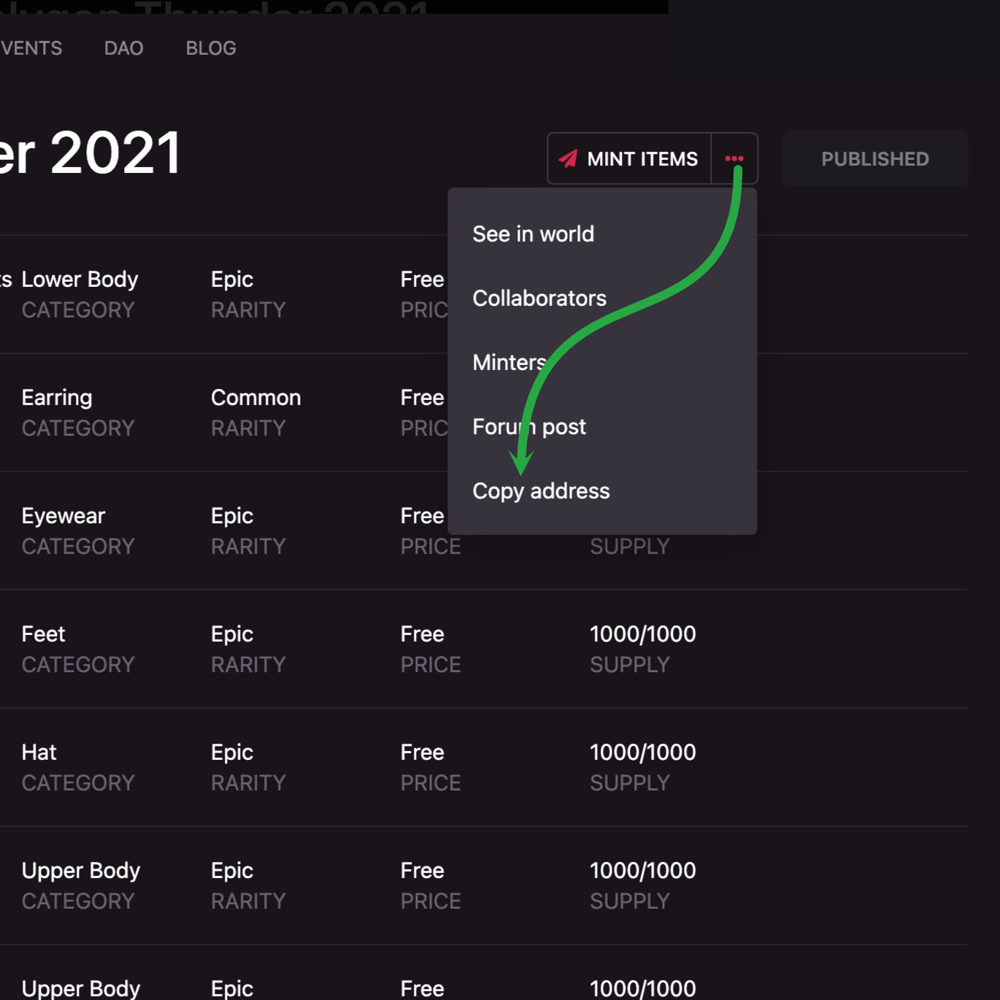
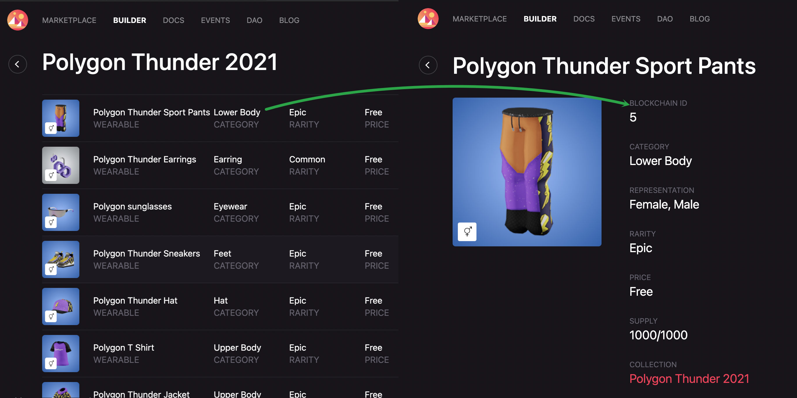

# Airdrops

Send wearables to a list of addresses

## `send` command line

Help output

```bash
npm run send -- --help
```

```bash
Options:
      --help      Show help                                                       [boolean]
      --version   Show version number                                             [boolean]
  -i, --input     CSV file with the addresses to airdrop                [string] [required]
  -c, --contract  The collection address on polygon                     [string] [required]
  -b, --batch     The amount of items minted by transactions         [number] [default: 50]
  -o, --output    The file to dump full logs (default: input file + .log))         [string]
  -s, --speed     The gas price use to send transactions
         [string] [choices: "safe", "safeLow", "low", "std", "standard", "fast", "fastest"]
      --min-gas   Define a max value for gas price to send transactions            [number]
      --max-gas   Define a min value for gas price to send transactions            [number]
```

&nbsp;

---------

&nbsp;

### Send wearables

Send wearables with a gas limit of 50 per transaction

```bash
npm run send -- --contract [COLLECTION_ADDRESS] --input address.csv --speed fast --max-gas 250
```

```bash
https://polygonscan.com/tx/0x1000...0000
waiting for transaction https://polygonscan.com/tx/0x1000...0000
https://polygonscan.com/tx/0x2000...0000
waiting for transaction https://polygonscan.com/tx/0x2000...0000
# ...
https://polygonscan.com/tx/0xffff...0000
waiting for transaction https://polygonscan.com/tx/0xffff...0000
```

&nbsp;

---------

&nbsp;

### Where do you get the `COLLECTION_ADDRESS`

Go to [`https://builder.decentraland.org/collections`](https://builder.decentraland.org/collections) open the collection you want to airdrop and copy its address



&nbsp;

### Create your `addresses.csv` file

In order to mint a big amount of wearables you will need a `.csv` file with an address and item id per line

```csv
ADDRESS,BLOCKCHAIN_ID
ADDRESS,BLOCKCHAIN_ID
ADDRESS,BLOCKCHAIN_ID
```

In the following example the address `0xfff...fff` is going to receive items `0` and `1` and the address `0xeee...eee` is going to receive only the item `1`

```csv
0xffffffffffffffffffffffffffffffffffffffff,0
0xffffffffffffffffffffffffffffffffffffffff,1
0xeeeeeeeeeeeeeeeeeeeeeeeeeeeeeeeeeeeeeeee,1
```

&nbsp;

### How to get the `BLOCKCHAIN_ID`

Go to [`https://builder.decentraland.org/collections`](https://builder.decentraland.org/collections) open the collection and then open the item details

